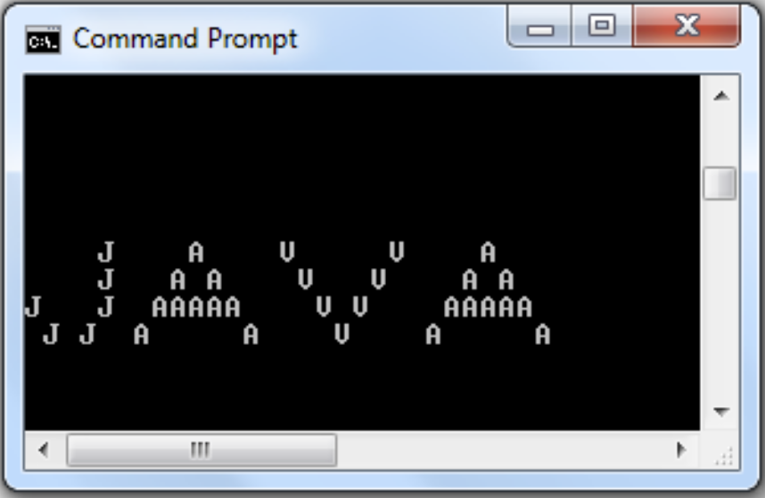

# Instructions

Print the word "JAVA" (all uppercase) using the characters "J", "A", and "V" once per letter in the word "JAVA," with 1 character of separation per new letter. See Module 1, Assignment 1 instructions and below for the example output.



# Thought Process
No diagram will be used due to lack of necessary interface(s) or producer-consumer models.

#### Assumptions
- The example output contains at least 1 whitespace character between each character in "JAVA"
- The example output contains the letters of "JAVA" in order, so that the "J" in "JAVA" is output/created using "J"
- The example output can be created using a series of `System.out.print` or `System.out.println`
- The example output can be manually created, or procedurally created so that the same can be done with any word
- The example output is of a console height of 4 lines and width of at least 29 characters
- The example output has 2 whitespaces between the J's at the bottom of "J" in "JAVA"
- The example output whitespaces can also be generated using the escape chaarcter for a tab, `\t`

#### Solution
The solution I implement will revolve around the manual creation of the word "JAVA" rather than a procedural method. Based on my current experience as a Java programmer and what I have learned so far in this course, this is likely the best approach to take without adding too much complexity. Because of this, there is not much of an explanation other than the usage of a trial-and-error method to ensure enough whitespaces exist between characters to generate the required output in the console.

# Implementation Code
The program was written in VSCode on WSL 2, Ubuntu 20.04.4 LTS.

Refer to `./PrintingJava.java` for program. See the code block below (if this is the PDF submission).

```java
// code block goes here for the actual PDF submission
```

# Implementation Output
Below is an output in the VSCode Integrated Terminal.


