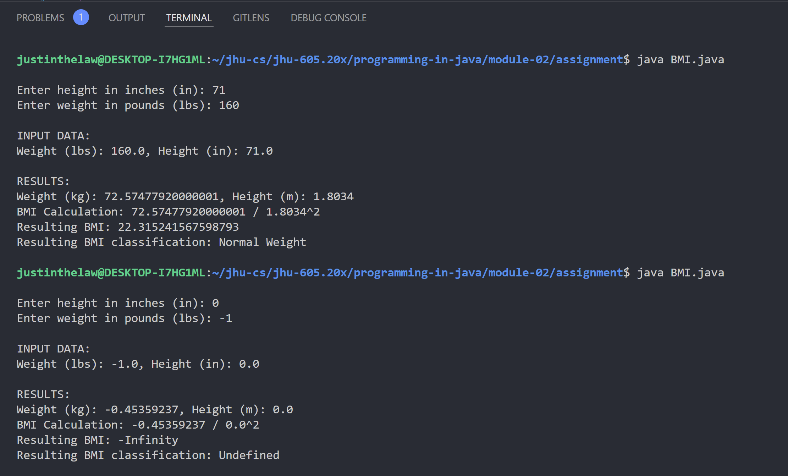

# Instructions

Body Mass Index (BMI) is a measure of health that is based on a person’s weight and height. It is calculated by dividing a person’s weight (in kilograms) by the square of a person’s height (in meters). Write a program that prompts the user to enter a weight (in pounds) and a height (in inches) and then displays the BMI. Note that one pound is 0.45359237 kilograms and one inch is 0.0254 meters. The program should also display the following BMI information from the Department of Health & Human Services/National Institutes of Health so a user can evaluate his/her BMI:

- Underweight: less than 18.5
- Normal: 18.5 – 24.9
- Overweight: 25 – 29.9
- Obese: 30 or greater

# Thought Process
No diagram was produced due to a lack of complexity in the interfaces and producer-consumer relationships within this assignment.

#### Discussion
The problem at hand does not have a required format, only that the program properly receives user-provided values of weight and height and outputs a BMI and classification to the user. That being said, the implementation output in my program will display the following in response to user-input:
- The original height converted to meters
- The original weight converted to kilograms
- The calculation being performed (weight / sqrt(height))
- The final resulting BMI and classification

#### Assumptions
- The same code-snippets, imports, and packages from the previous assignment problem (2.1) from `Original.java` can be reused and refactored
- The user will input their height in inches and weight in pounds as no larger than a number of ###.## size (Java float)
- The conversion factors and BMI calculation will be performed in Java double precision
  - Casting the original user-input of a Java float to a Java double will be required
- The user-provided input values are never input incorrectly, to include the following possible mistakes:
    - Not entering a values within the range of a Java float
    - Entering values of different types
    - Not entering values at all
    - Entering too many values (should be ignored anyway)
- Checking the user-provided input values is not required, as it is not explicitly stated in this assignment

# Implementation Code
The program was written in VSCode on WSL 2, Ubuntu 20.04.4 LTS.

Refer to `./BMI.java` for program. See the code block below (if this is the PDF submission).

```java
// code block goes here for the actual PDF submission
```

# Implementation Output
Below is an output in the VSCode Integrated Terminal.


