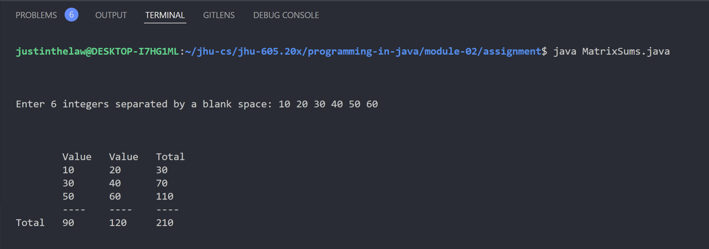

# Instructions

Download the program named Original.java. The program prompts the user to enter six integers and then displays the integers in tabular 3 rows by 2 columns format. Modify the program so that the output looks like the output below. The user may enter any values for the integers.


# Thought Process


#### Assumptions


# Implementation Code
The program was written in VSCode on WSL 2, Ubuntu 20.04.4 LTS.

Refer to `./MatrixSums.java` for program. See the code block below (if this is the PDF submission).

```java
// code block goes here for the actual PDF submission
```

# Implementation Output
Below is an output in the VSCode Integrated Terminal.


