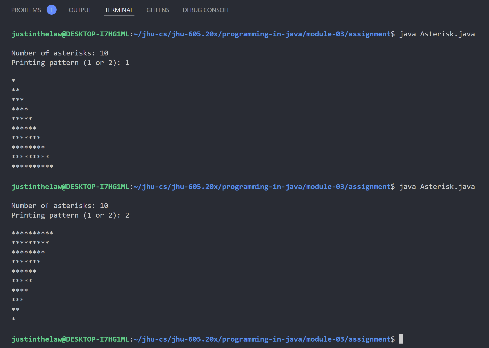

# Instructions

Write a program that prompts the user to enter the maximum number of asterisks (*) to display on a
line of output, as well as a choice of two different output patterns. The program shall then display the
asterisks according to one of the patterns below. For example, if the user specifies 10 as the maximum
number of asterisks, the output should look like one of the following:
```
Number of asterisks = 10

Choice = 1
*
**
***
****
*****
******
*******
********
*********
**********

Choice = 2
**********
*********
********
*******
******
*****
****
***
**
*
```

# Thought Process
No diagram was produced due to a lack of complexity in the interfaces and producer-consumer relationships within this assignment.

#### Discussion
- The prompt should ask for the user to input a number above 0
    - This would inform a for loop for printing asterisks
- The prompt will then immediately ask for an option for asterisk printing
    - This would inform the an if-statement that decides the direction in which asterisk count increases or decreases
- The console then prints out the requested output

#### Assumptions
- Handling and checking of the user input can be done in any manner

# Implementation Code
The program was written in VSCode on WSL 2, Ubuntu 20.04.4 LTS.

Refer to `./Asterisk.java` for program. See the code block below (if this is the PDF submission).

```java
// code block goes here for the actual PDF submission
```

# Implementation Output
Below is an output in the VSCode Integrated Terminal.


