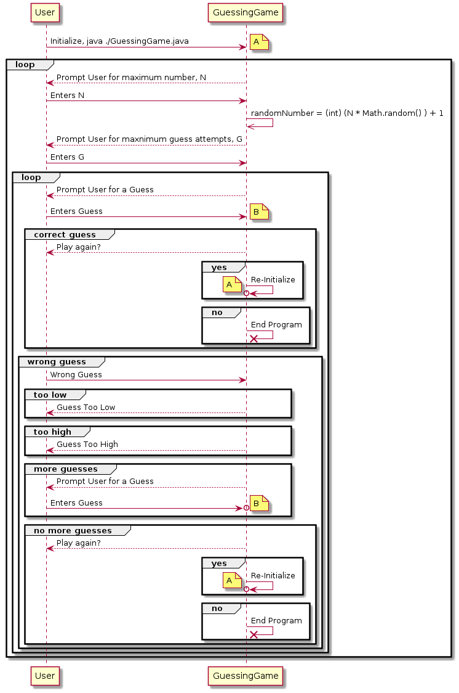
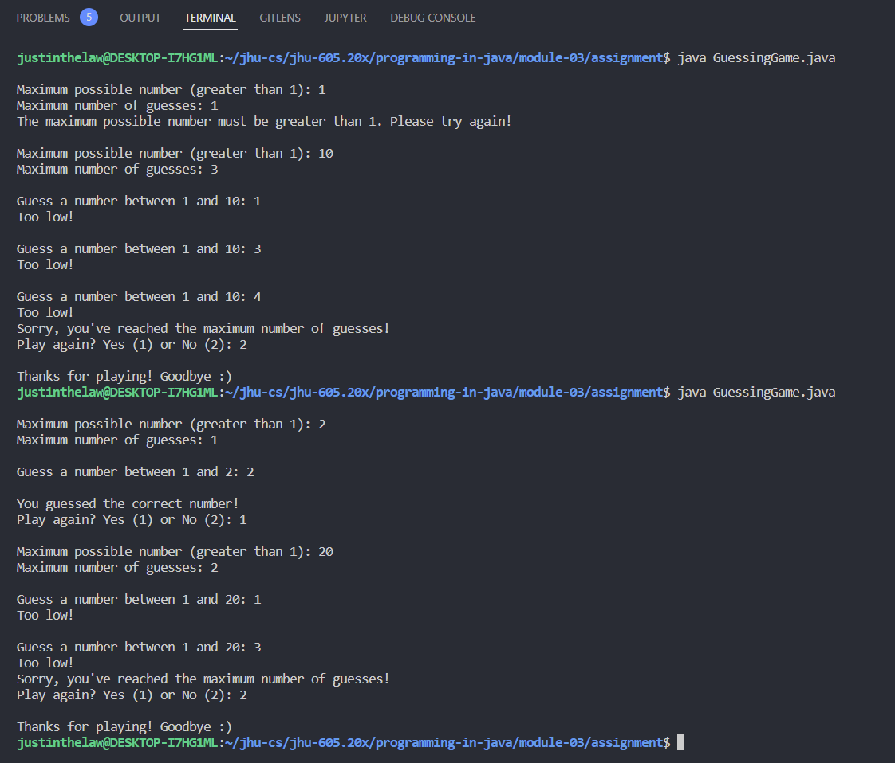

# Instructions

Write a program that asks a user to guess a secret number between 1 and N, where N is a positive
number that the user is prompted for. The program should also prompt the user for the maximum
number of guesses they would like to make. Each time the player makes a guess, the program shall
respond with “correct”, “too low”, or “too high”. The program should keep track of the number of
guesses the user made to discover the secret number. The program should continue execution until the
user has discovered the secret number or has exceeded the maximum number of guesses. The program
shall also allow the user to play the game again until the user declines. The program should generate
the magic number randomly, using the built-in Java method Math.random(). To generate a random
number between 1 and n, the following formula may be used:

`randomNumber = (int) (n * Math.random() ) + 1`

# Thought Process

#### Discussion
Below is a diagram of the use case and expected behaviour of GuessingGame.java generated using PlantUML, the problem statement givens, and the assumptions listed below the diagram. See the [PlantUML](#PlantUML) section



#### Assumptions
- Handling and checking of the user input can be done in any manner

# Implementation Code
The program was written in VSCode on WSL 2, Ubuntu 20.04.4 LTS.

Refer to `./Asterisk.java` for program. See the code block below (if this is the PDF submission).

```java
// code block goes here for the actual PDF submission
```

# Implementation Output
Below is an output in the VSCode Integrated Terminal.



# PlantUML
```
@startuml GuessingGame

User -> GuessingGame: Initialize, java ./GuessingGame.java
loop
  note right: A
  GuessingGame --> User: Prompt User for maximum number, N
  User -> GuessingGame: Enters N
  GuessingGame --> User: Prompt User for maxnimum guess attempts, G
  User -> GuessingGame: Enters G
  GuessingGame ->> GuessingGame: randomNumber = (int) (n * Math.random() ) + 1
  loop
    GuessingGame --> User: Prompt User for a Guess
    User -> GuessingGame: Enters Guess
    note right: B

    group correct guess
      GuessingGame --> User: Play again?
      group yes
        GuessingGame ->o GuessingGame: Re-Initialize
      end
      group no
        GuessingGame ->x GuessingGame: End Program
      end
    end

    group wrong guess
      User -> GuessingGame: Wrong Guess
      group too low
        GuessingGame --> User: Guess Too Low
      end
      group too high
        GuessingGame --> User: Guess Too High
      end
      group more guesses
        GuessingGame --> User: Prompt User for a Guess
        User ->o GuessingGame: Enters Guess
        note right: B
      end
      group no more guesses
        GuessingGame --> User: Play again?
        group yes
          GuessingGame ->o GuessingGame: Re-Initialize
          note left: A
        end
        group no
          GuessingGame ->x GuessingGame: End Program
        end
      end

    end
  end
end

@enduml
```
