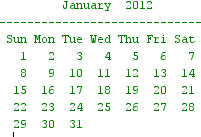

# Instructions

Write a program that prompts the user to enter a month (1-12) and a year (e.g., 2012), and then displays a calendar for that month and year as illustrated below:



The program must use the following methods:

| Method                                         | Description                                                                                          |
| :--------------------------------------------- | :--------------------------------------------------------------------------------------------------- |
| `void printMonthCalendar(int month, int year)` | Displays a calendar like the one above for a specified month and year.                               |
| `void printMonthHeader(int month, int year)`   | Displays the header information (month, year, line separator, 3-character day names) for a calendar. |
| `void printMonthBody(int month, int year)`     | Displays the days in the calendar associated with the corresponding days of the week.                |
| `String getMonthName(int month)`               | Returns the name of the month for a specified month number (e.g., returns March for m=3).             |
| `int getStartDay(int month, int year)`         | Returns the day of week number (1=Monday,…, 7= Sunday) for the specified month and year.             |
| `int getNumDaysInMonth(int month, int year)`   | Returns the number of days in specified month and year. Leap years are accounted for.                |
| `boolean isLeapYear(int year)`                 | Returns true if the specified year is a leap year, and returns false otherwise.                      |

Here is a version of Zeller's algorithm you can use: https://codereview.stackexchange.com/questions/67722/its-friday-zellers-congruence-revisited
See [getStartDay.java](./getStartDay.java)

# Thought Process

#### Discussion

- With the exception of the methods that are already explained in the tables above, the following must also be implemented:
    - Method to receive and store user input for usage by other methods
    - A main method to synchronously run all other methods in the correct order to produced desired result
- Obtaining the month name and number of days in the month is a matter of hard-coded Map data structure
    - An exception is that the Map will have to have 13 key-value pairs to handle February leap year days
- Printing the body using the number of days in the month and starting day of the week will require some checking and for-loop logic
    - Every time the month day number hits the last day of the week, Sunday (7), there must be a new line to start the next week and continue

#### Assumptions

- Handling and checking of the user input can be done in any manner
    - Must ensure the user enters a month that is 1-12
    - Must ensure that the year is above 1
- Leap year only affects the calendar calculation internally and is not visible to the user unless the user sees or requests February
- Zeller's algorithm logic is correct once refactored for implementation in the class
    - Any year above 1 will produce a correct result

# Implementation Code

The program was written in VSCode on WSL 2, Ubuntu 20.04.4 LTS.

Refer to `./CalendarMonth.java` for program. See the code block below (if this is the PDF submission).

```java
// code block goes here for the actual PDF submission
```

# Implementation Output

Below is an output in the VSCode Integrated Terminal.


