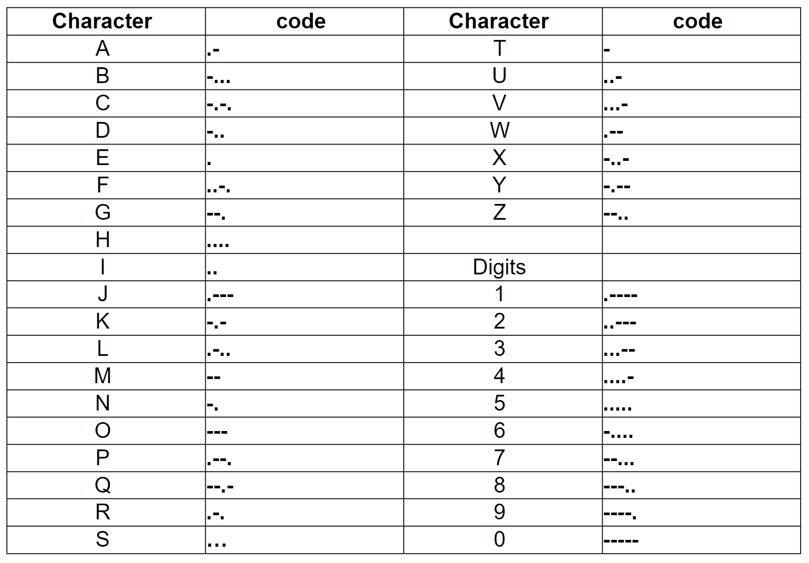

# Instructions

This project involves writing a program to translate Morse code into English and English into Morse code. Your program shall prompt the user to specify the desired type of translation, input a string of Morse code characters or English characters, then display the translated results. The Morse code pattern and English letter translations must be kept and processed using either two one-dimensional or one two-dimensional arrays.When you input Morse code, separate each letter/digit with a single space, and delimit multiple words with a “|”. For example, - --- | -... . would be the Morse code input for the sentence “to be”. Your program only needs to handle a single sentence and can ignore punctuation symbols. When you input English, separate each word with a blank space.

The international version of Morse code for alphabetic characters and digits is shown in the table below.



# Thought Process

#### Discussion


#### Assumptions


# Implementation Code

The program was written in VSCode on WSL 2, Ubuntu 20.04.4 LTS.

Refer to `./MorseCodeTranslator.java` for program. See the code block below (if this is the PDF submission).

```java
// code block goes here for the actual PDF submission
```

# Implementation Output

Below is an output in the VSCode Integrated Terminal.


