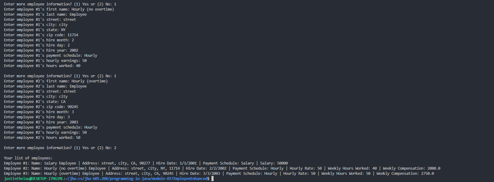

# Instructions

This assignment will use the Employee class that you developed for assignment 6. Design two sub-classes of Employee...SalariedEmployee and HourlyEmployee. A salaried employee has an annual salary attribute. An hourly employee has an hourly pay rate attribute, an hours worked attribute, and an earnings attribute. An hourly employee that works more than 40 hours in a week gets paid at 1.5 times their hourly pay rate for the hours over 40 hours. You will decide how to implement constructors, getters, setters, and any other methods that might be necessary.

Draw a UML diagram for this exercise. Implement the classes, and write a test program that:

1. Creates a salaried employee
2. Creates two hourly employees:
   - One of the hourly employees should have hours worked set to less than 40
   - One of the hourly employees should have hours worked set to more than 40

The test program should display all attributes for the three employees. To keep things simple, the employee classes don’t need to do any editing.

# Thought Process

## Assumptions

- All [assumptions from Module-06 (Employee)](../module-06/Employee.md) are still relevant and correct
- All [code from Module-06 (Employee)](../module-06/Employee/) is still relevant and correct
- Editing or opportunities for a user to correct incorrect data entry are not required
- Incorrect entries will lead to a default value as defined in each class
- The test program must receive input for and display (print) all module-06 Employee attributes alongside the newly instantiated SalariedEmployee and HourlyEmployee -unique attributes
- Earnings is a whole integer number, Overtime rates is a float (1.5f), Hours worked is a whole integer number

## Diagram

The UML diagram was built using [mermaid.js](https://mermaid-js.github.io/mermaid/#/), a markdown language for building Unified Modelling Language (UML) Diagrams, Entity Relationship Siagrams (ERDs), and more.


## Discussion

- All [discussion from Module-06 (Employee)](../module-06/Employee.md) are still relevant and correct
- Implementation follows the thought process outlined in the UML class diagram above.
- The Employee class was modified to refit the Employee class into an abstract class to be inherited by the SalariedEmployee and HourlyEmployee subclasses.
- The application (App.java) was modified to instantiate the subclasses and display their information once user input is received.
- The 3 test scenarios presented in the instructions will just be user-input based instead of hardcoded. User input provided by Justin Law (me) will be used to generate the 3 different variations of Employee.

# Implementation Code

The program was written in VSCode on WSL 2, Ubuntu 20.04.4 LTS.

Refer to [./EmployeeEnhanced/src](../module-07/EmployeeEnhanced) for program. See the code block below (if this is the PDF submission).

```java
// code block goes here for the actual PDF submission
```

# Implementation Output

Below is an output in the VSCode Integrated Terminal.



