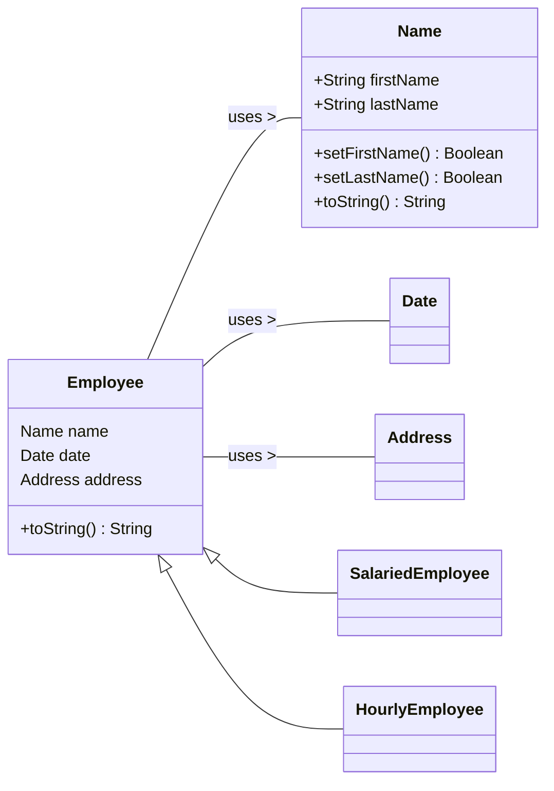

```mermaid
classDiagram
    direction LR

    %% Employee base class and helper classes %%
    %% Employee
    Employee -- Name : uses >
    Employee -- Date : uses >
    Employee -- Address : uses >

    Employee: Name name
    Employee: Date date
    Employee: Address address

    class Employee{
        +toString() String
    }

    %% Name
    class Name{
        +String firstName
        +String lastName
        +setFirstName() Boolean
        +setLastName() Boolean
        +toString() String
    }

    %% Employee subclasses %%
    Employee <|-- SalariedEmployee
    Employee <|-- HourlyEmployee
```
