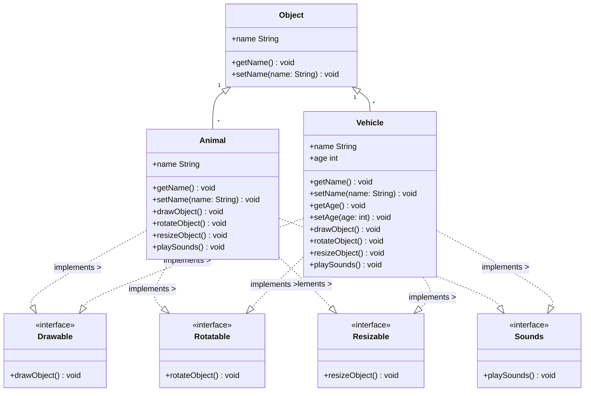

# Instructions

Imagine your project team is developing a Java application that will serve as an educational tool to help children learn about various concepts such as vehicles, animals, sounds, etc. The application will have a need to draw various objects (e.g., animals, vehicles) on the video display as well as to rotate objects, resize objects, and play sounds that are associated with the objects. Your project manager has specified that all objects in the application should use a common interface for drawing, rotating, resizing, and playing sounds, and that these interfaces should be reusable for other application projects as well. Some future applications will need to make sounds, some will need drawing capability, some will need rotating capability, some will need resizing capability, and some will need all capabilities. A method called drawObject() will be used for drawing objects, a method called rotateObject() will be used for rotating objects, a method called resizeObject() will be used for resizing objects, and a playSound() method will be used for playing sounds.

1. Design the interface classes Drawable, Rotatable, Resizable and Sounds.
2. Develop a program called Manipulater that does the following: An Animal class will be used to model some basic characteristics of animals for the application. An animal will have a name attribute and methods to set the name and get the name. Animals can make sounds and are drawable, rotatable, and resizable. A Vehicle class will be used to model some basic characteristics of vehicles. A vehicle will have a name and an age, and methods to get/set these attributes. Vehicles can also make sounds and are drawable, rotatable, and resizable. Create a collection of 2 vehicles and 2 animals stored in the same array. Loop through the array and execute the drawObject(), rotateObject(), resizeObject(), and playSound() methods polymorphically for each element in the array. The drawObject() method should simply display the message “Drawing a Vehicle” or “Drawing an Animal”; the rotateObject() method should display the message “Rotating a Vehicle” or “Rotating an Animal”; and the playSound() method should display the message “Animal sound” or “Vehicle sound”, depending upon the type of element that is in the array. The resizeObject() method should display “Resizing a Vehicle” or “Resizing an Animal”.

# Thought Process

## Assumptions

- No user input is required to create the Animal and Vehicle classes, only hard-coded test in App.java's main method

## Diagram

The UML diagram was built using [mermaid.js](https://mermaid-js.github.io/mermaid/#/), a markdown language for building Unified Modelling Language (UML) Diagrams, Entity Relationship Siagrams (ERDs), and more.



## Discussion

- The presented problem is simple enough and is mostly explained by the UML diagram
- A superclass named Object will be used to store Animals and Vehicles in an array before they are called polymorphically to perform their common methods
- All interface classes will be used by the object classes, Animal and Vehicle, and the interface methods will be implemented
- All object classes will contain their required attributes and getters/setters implemented

# Implementation Code

The program was written in VSCode on WSL 2, Ubuntu 20.04.4 LTS.

Refer to [./Manipulator/src](../module-07/Manipulator) for program. See the code block below (if this is the PDF submission).

```java
// code block goes here for the actual PDF submission
```

# Implementation Output

Below is an output in the VSCode Integrated Terminal.


